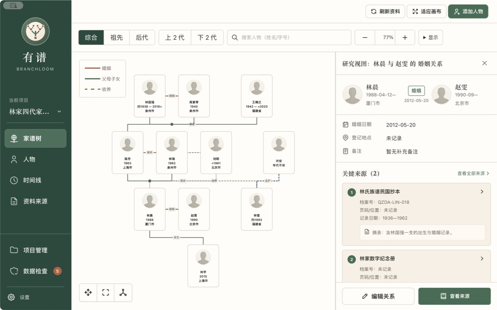
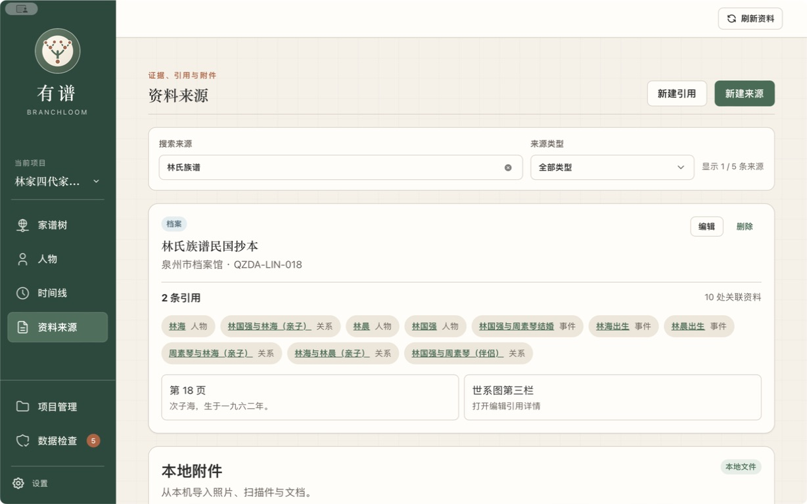
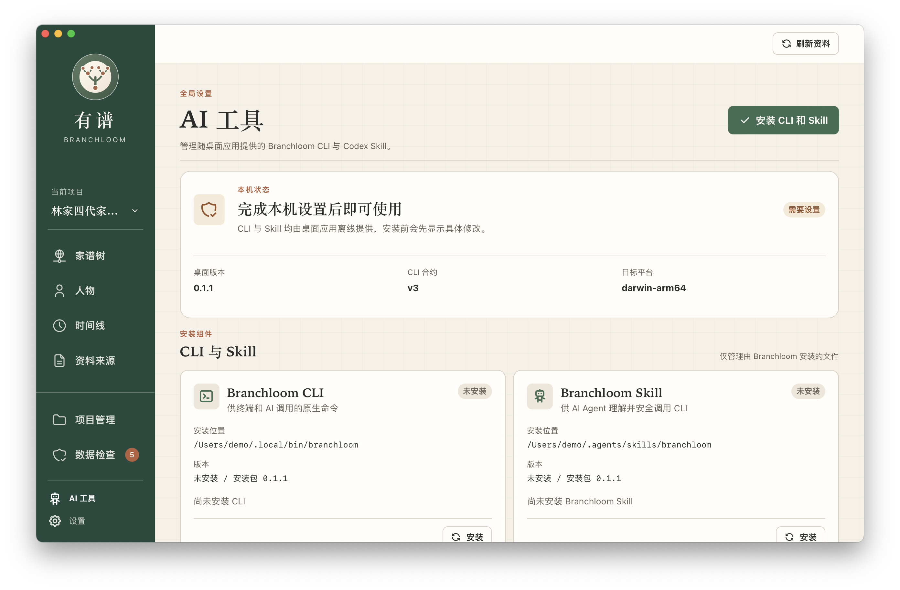
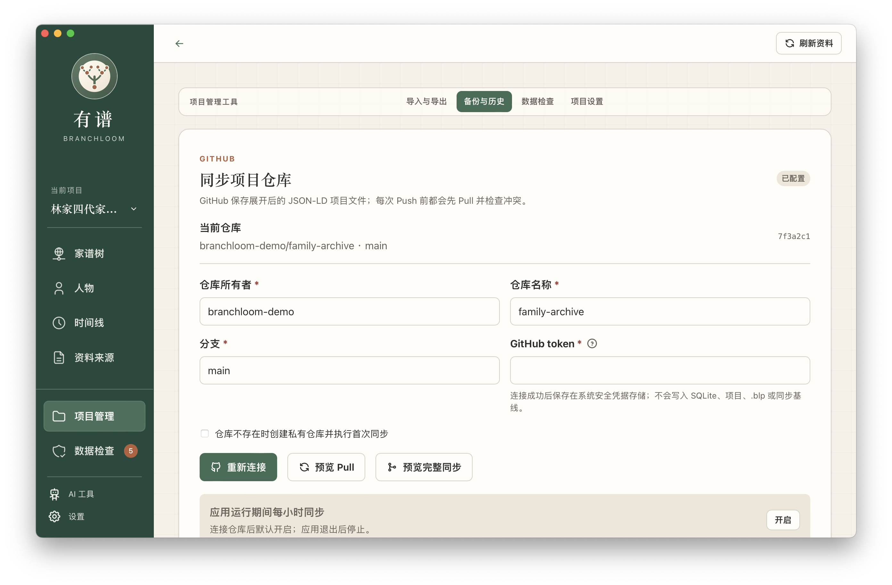

<p align="center">
  
</p>

<h1 align="center">有谱 · Branchloom</h1>

<p align="center">
  <strong>把散落的名字、照片与往事，整理成一份可以长久保存的家族档案。</strong>
</p>

<p align="center">
  本地优先 · 无需注册 · 开放格式 · 支持 macOS / Windows / Linux
</p>

<p align="center">
  <a href="https://github.com/tenlee2012/branchloom/releases">下载桌面版</a>
  ·
  <a href="DATA_FORMAT.md">开放数据格式 `.blp`</a>
  ·
  <a href="packages/cli/README.md">CLI 文档</a>
</p>



> 截图使用虚构的演示家族、仓库与安装路径；真实家谱默认只保存在用户自己的设备上。

## 家谱不只是一张关系图

有谱是一款本地优先的家谱与家庭资料管理应用。它把人物、关系、事件、地点、史料来源和附件放在同一个项目中，让一段家族历史既能被直观浏览，也能保留可以追溯的依据。

| | |
| --- | --- |
| **资料真正属于你**<br>无需账号，离线可用；可以完整备份、迁移或同步到自己的私有 GitHub 仓库。 | **尊重真实的家庭经历**<br>支持亲生、收养、继亲、监护和多种伴侣关系，不用单一模板简化复杂人生。 |
| **每条记忆都有来处**<br>把档案、访谈、引文、页码和本地附件关联到人物、关系与事件。 | **为长期保存而设计**<br>通过 `.blp` 完整项目包、GEDCOM 和开放格式，避免资料被锁在某个网站里。 |

## 从关系到故事

<table>
  <tr>
    <td width="50%">
      
      <br><strong>人物档案</strong><br>
      记录多种姓名、生卒信息、地点、生平、职业经历、备注、头像与相关资料。
    </td>
    <td width="50%">
      
      <br><strong>家族时间线</strong><br>
      把出生、婚姻、迁徙与家庭事件放回时间中，沿年代阅读家族故事。
    </td>
  </tr>
  <tr>
    <td colspan="2">
      
      <br><strong>来源、引用与附件</strong><br>
      从一页族谱、一段访谈或一张旧照片出发，看见它支持了哪些人物、关系和事件。
    </td>
  </tr>
</table>

## AI 与 GitHub：让整理更高效，也更可控

### 让 AI 在清晰的边界内协助整理

有谱桌面端直接提供版本匹配的原生 CLI 和 Codex Skill。AI Agent 可以理解家谱结构、查找资料、生成修改计划，并在得到确认后完成批量整理；整个过程复用桌面端相同的核心规则和数据目录，不需要为 AI 再维护一套数据库逻辑。



- CLI 与 Skill 随桌面安装包离线提供，不依赖 npm、npx、Node.js 或常驻后台服务。
- “AI 工具”页面统一检查桌面版本、CLI 合约、目标平台和组件完整性，并支持安装、更新、修复与卸载。
- 写操作默认先生成预览；真正提交时必须携带同一计划的版本标识，资料发生变化后旧计划会失效。
- 删除、关系变更等高风险操作还需要额外的危险操作确认，不允许 AI 静默绕过。
- 每次成功写入都会返回可追踪的变更集，便于核对后续影响。

### 把项目同步到自己的 GitHub 私有仓库

GitHub 同步是完全可选的远端备份与协作方式。仓库中保存的是展开后的 JSON-LD 项目文件和附件，而不是难以审阅的 SQLite 数据库；因此既能使用 Git 版本历史，也能直接查看每次资料变化。



- 可以连接已有仓库，也可以在明确确认后创建新的私有仓库并执行首次同步。
- 每次 Push 前始终先 Pull，再进行字段级三方合并；存在冲突时必须由用户选择结果，未解决前不会 Push。
- Pull、完整同步和冲突处理都先生成预览，确认后才会修改本地资料或远端仓库。
- GitHub token 只保存在系统安全凭据存储中，不会进入 SQLite、项目文件、`.blp` 包或同步基线。
- 支持手动同步，也可以在应用运行期间开启每 60 分钟自动同步；应用退出后自动停止。

## 主要能力

### 整理家族资料

- 创建和管理多个家谱项目。
- 记录人物的多种姓名、生卒信息、生平、职业、称谓、备注和头像。
- 整理亲生、收养、继亲、监护，以及婚姻、订婚、事实伴侣、分居、离异等关系。
- 从家谱树、人物列表和时间线浏览家庭资料。
- 管理地点、家庭事件、史料来源、引文与本地附件。

### 核对、备份与迁移

- 搜索人物，并检查日期异常、关系问题、重复人物和缺失附件。
- 比较并合并疑似重复档案。
- 创建可恢复的历史快照。
- 导入或导出包含附件的 `.blp` 完整项目包。
- 导入或导出 GEDCOM 5.5、5.5.1 与 7.0 中常见的人物及家庭关系资料。
- 可选连接自己的 GitHub 私有仓库，通过 Git 版本历史备份、同步与回切项目。

## 数据与隐私

- 家谱资料默认只保存在本机，不注册账号也能完整使用。
- GitHub 同步完全可选；访问凭据不会写入家谱项目或导出的项目包。
- GitHub 私有仓库不是端到端加密存储；请只授予可信成员访问权限，并谨慎同步仍在世成员的资料。
- 附件会被复制到项目管理区域，并按内容哈希去重；业务记录不保存原始文件路径。
- `.blp` 项目包包含完整资料和附件，可用于备份、迁移与分享。
- 项目格式公开可读，详细约定见 [DATA_FORMAT.md](DATA_FORMAT.md)。

家谱常常包含仍在世成员的敏感信息。分享项目包、截图或同步仓库前，请先征得相关家庭成员同意，并确认分享范围。重要资料建议保留至少一份独立备份，并在升级前导出 `.blp` 项目包。

## 获取有谱

前往 [GitHub Releases](https://github.com/tenlee2012/branchloom/releases) 下载与操作系统匹配的安装包。macOS 用户请根据设备选择 `aarch64`（Apple 芯片）或 `x64`（Intel 芯片）版本。

<details>
<summary><strong>macOS 首次安装提示</strong></summary>

目前 macOS 安装包使用 ad-hoc 签名，尚未使用 Apple Developer ID 签名和公证。请只从本项目官方 Releases 下载并确认来源可信。

将“有谱”拖入“应用程序”文件夹后，如果系统提示“App 已损坏”或无法验证开发者，请打开“终端”执行：

```bash
xattr -dr com.apple.quarantine "/Applications/有谱.app"
open "/Applications/有谱.app"
```

该命令只移除“有谱”的互联网下载隔离标记，不会关闭系统的全局 Gatekeeper。仅对从本项目官方 Releases 下载的安装包执行此操作。

</details>

<details>
<summary><strong>Windows 安装提示</strong></summary>

Windows 安装包目前未进行商业代码签名，安装时操作系统可能显示安全提醒。请确认安装包来自本项目官方 Releases 后再继续。

</details>

## 安装 CLI 与 Codex Skill

打开桌面端的“AI 工具”页面，即可安装、更新、修复或卸载与当前桌面版本匹配的 Branchloom CLI 和 Codex Skill。

- macOS / Linux 默认安装到 `~/.local/bin`。
- Windows 默认安装到 `%LOCALAPPDATA%\Branchloom\bin`。
- Skill 默认安装到 `~/.agents/skills/branchloom`。
- 如果目录尚未加入 `PATH`，桌面端会显示可复制的配置方法，但不会自动修改 Shell 或系统设置。

机器协议、隔离数据目录和命令示例见 [CLI 文档](packages/cli/README.md)。

## 本地开发

需要 Node.js、pnpm 10.15.1 和 Rust 工具链。安装依赖后可启动 Web 开发模式：

```bash
pnpm install
pnpm dev
```

常用检查：

```bash
pnpm typecheck
pnpm test:unit
pnpm test:cli
```

## 参与项目

欢迎通过 Issue、Discussion 或 Pull Request 参与有谱：报告问题、提出真实的家谱整理场景、改进无障碍体验与文案，或协助测试数据导入、备份和跨平台体验。

提交问题时，请使用虚构或脱敏的示例，不要上传真实家谱、私人附件、访问凭据或其他敏感信息。

## 项目原则

1. 本地资料优先于在线服务。
2. 用户可以完整导出并迁移自己的数据。
3. 不以“常见”为由拒绝真实存在的家庭关系。
4. 重要事实应当能够关联来源。
5. 破坏性操作必须清楚、可预期。

## 开源许可

本项目采用 [Apache License 2.0](LICENSE) 开源。第三方组件分别遵循其各自的许可证，详见 [第三方软件声明](THIRD_PARTY_NOTICES.md)。
